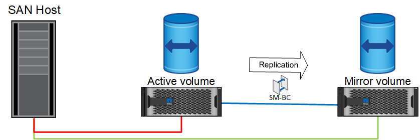
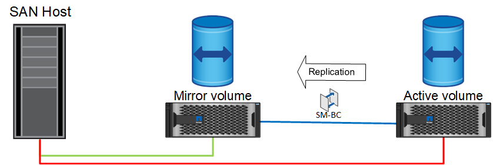

= Funcionamento normal
:allow-uri-read: 

O SnapMirror active Sync oferece suporte a dois tipos de operações de failover de storage: Planejadas e não planejadas, que funcionam de maneiras ligeiramente diferentes. Um failover planejado é iniciado manualmente pelo administrador para o switchover rápido para um local remoto, enquanto o failover não planejado é iniciado automaticamente pelo mediador no terceiro local. O principal objetivo de um failover planejado é executar patches e atualizações incrementais, executar testes de recuperação de desastres ou adotar uma política formal de alternar as operações entre locais ao longo do ano para provar a capacidade de sincronização ativa total.

Os diagramas mostram o que acontece durante operações normais de failover e failback. Para facilitar a ilustração, eles retratam um LUN replicado. Em uma configuração de sincronização ativa do SnapMirror real, a replicação é baseada em volumes, onde cada volume contém um ou mais LUNs, mas para simplificar a imagem, a camada de volume foi removida.

== Funcionamento normal

Em funcionamento normal, é possível aceder a um LUN a partir da réplica local ou remota. A linha vermelha indica o caminho otimizado como anunciado pela ALUA, e o resultado deve ser que o IO seja enviado preferencialmente por esse caminho.

A linha verde é um caminho ativo, mas incorreria em mais latência porque a e/S nesse caminho precisaria ser passada pelo caminho de sincronização ativa do SnapMirror. A latência adicional dependeria da velocidade da interconexão entre locais que é usada para a sincronização ativa do SnapMirror.

== Falha

Se a cópia espelhada ativa ficar indisponível, seja por causa de failover planejado ou não planejado, obviamente ela não será mais utilizável. No entanto, o sistema remoto possui uma réplica síncrona e já existem caminhos SAN para o local remoto. O sistema remoto é capaz de atender a e/S para esse LUN.

image:../media/smas-failover-2.png["Falha na sincronização ativa do SnapMirror"]

== Failover

O failover faz com que a cópia remota se torne a cópia ativa. Os caminhos são alterados de Ativo para Ativo/otimizado, e a e/S continua a ser atendida sem perda de dados.

== Repare

Uma vez que o sistema de origem é retornado ao serviço, o SnapMirror ative Sync pode ressincronizar a replicação, mas executando a outra direção. A configuração agora é essencialmente a mesma que o ponto de partida, exceto os sites ative-mirror foram invertidos.

== Failback

Se desejado, um administrador pode executar um failback e mover a cópia ativa dos LUN(s) de volta para os controladores originais.

