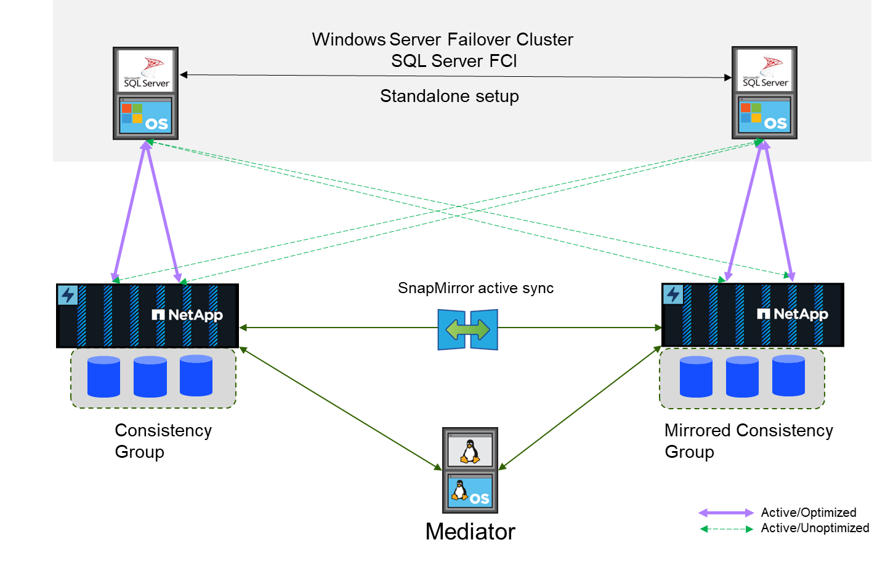

= Visão geral
:hardbreaks:
:allow-uri-read: 
:icons: font
:linkattrs: 
:imagesdir: ../media/

[role="lead"]
O SnapMirror active Sync permite que bancos de dados e aplicações individuais do SQL Server continuem as operações durante interrupções de storage e rede, com failover transparente de storage sem qualquer intervenção manual.

Iniciando o ONTAP 9.15,1, o SnapMirror ative Sync suporta arquitetura ativa-ativa simétrica, além da configuração assimétrica existente. A funcionalidade ativo-ativo simétrica fornece replicação bidirecional síncrona para continuidade dos negócios e recuperação de desastres. Ele ajuda você a proteger o acesso a dados para workloads SAN críticos com acesso de leitura e gravação simultâneos a dados em vários domínios de falha, garantindo operações ininterruptas e minimizando o tempo de inatividade durante desastres ou falhas do sistema.

Os hosts do SQL Server acessam o storage usando Fibre Channel (FC) ou iSCSI LUNs. Replicação entre cada cluster que hospeda uma cópia dos dados replicados. Como esse recurso é replicação no nível de armazenamento, as instâncias do SQL Server executadas em instâncias de cluster de host ou failover independentes podem executar operações de leitura/gravação em cluster. Para obter informações sobre as etapas de Planejamento e configuração, link:https://docs.netapp.com/us-en/ontap/snapmirror-active-sync/["Documentação do ONTAP na sincronização ativa do SnapMirror"]consulte .

== Arquitetura de sincronização ativa do SnapMirror com ativo-ativo simétrico

**Replicação síncrona**

Em operação normal, cada cópia é uma réplica síncrona RPO/0 em todos os momentos, com uma exceção. Se os dados não puderem ser replicados, o ONTAP cumprirá o requisito de replicar dados e retomar a distribuição de I/o em um local, enquanto os LUNs no outro local ficam offline.

**Hardware de armazenamento**

Ao contrário de outras soluções de recuperação de desastres de storage, o SnapMirror active Sync oferece flexibilidade assimétrica de plataforma. O hardware em cada local não precisa ser idêntico. Esse recurso permite dimensionar corretamente o hardware usado para suportar a sincronização ativa do SnapMirror. O sistema de storage remoto pode ser idêntico ao local principal se precisar dar suporte a uma carga de trabalho de produção completa, mas se um desastre resultar em e/S reduzida, do que um sistema menor no local remoto pode ser mais econômico.

**Mediador ONTAP**

O Mediador ONTAP é um aplicativo de software que é baixado do suporte do NetApp e normalmente é implantado em uma pequena máquina virtual. O Mediador ONTAP não é um tiebreaker. É um canal de comunicação alternativo para os dois clusters que participam da replicação de sincronização ativa do SnapMirror. As operações automatizadas são orientadas pelo ONTAP com base nas respostas recebidas do parceiro por meio de conexões diretas e por meio do mediador.
