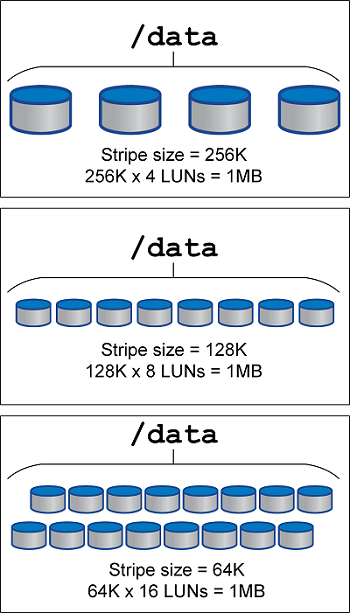

= LVM striping (distribuição LVM)
:hardbreaks:
:allow-uri-read: 
:nofooter: 
:icons: font
:linkattrs: 
:imagesdir: ../media/

[role="lead"]
A distribuição de LVM refere-se à distribuição de dados entre vários LUNs. O resultado é uma melhoria significativa na performance de muitos bancos de dados.

Antes da era das unidades flash, a distribuição foi usada para ajudar a superar as limitações de desempenho das unidades giratórias. Por exemplo, se um sistema operacional precisar executar uma operação de leitura 1MB, ler que 1MB TB de dados de uma única unidade exigiria muita busca e leitura de cabeça de unidade, pois o 1MB é transferido lentamente. Se esse 1MB TB de dados fosse distribuído em 8 LUNs, o sistema operacional poderia emitir oito operações de leitura 128K em paralelo e reduzir o tempo necessário para concluir a transferência 1MB.

A gravação em faixas com discos rígidos era mais difícil porque o padrão de E/S precisava ser conhecido antecipadamente. Se o striping não estiver configurado corretamente para os padrões reais de E/S, as configurações em striping podem prejudicar o desempenho. Com bancos de dados Oracle, e especialmente com configurações de armazenamento totalmente em flash, o striping é muito mais fácil de configurar e comprovadamente melhora drasticamente o desempenho.

Gerenciadores de volume lógicos, como o Oracle ASM stripe por padrão, mas o LVM de SO nativo não. Alguns deles unem vários LUNs como um dispositivo concatenado, o que resulta em datafiles que existem em um e apenas um dispositivo LUN. Isso causa pontos quentes. Outras implementações de LVM são padrão para extensões distribuídas. Isso é semelhante ao striping, mas é mais grosseiro. Os LUNs no grupo de volumes são cortados em pedaços grandes, chamados de extensões e normalmente medidos em muitos megabytes, e os volumes lógicos são então distribuídos por essas extensões. O resultado é a e/S aleatória contra um arquivo deve ser bem distribuída entre LUNs, mas as operações de e/S sequenciais não são tão eficientes quanto poderiam ser.

A e/S de aplicativos intensivos quase sempre é (a) em unidades do tamanho básico do bloco ou (b) um megabyte.

O principal objetivo de uma configuração de distribuição é garantir que a e/S de arquivo único possa ser executada como uma única unidade, e as e/S de vários blocos, que devem ter 1MB MB de tamanho, possam ser paralelizadas uniformemente em todos os LUNs no volume distribuído. Isso significa que o tamanho do stripe não deve ser menor que o tamanho do bloco do banco de dados e o tamanho do stripe multiplicado pelo número de LUNs deve ser 1MB.

[NOTE]
====
Melhores práticas para o uso de LVM striping em bancos de dados Oracle:

* Tamanho da faixa ≥ tamanho do bloco do banco de dados.
* Tamanho da faixa * número de LUNs ≈ 1 MB para paralelismo ideal.
* Utilize vários LUNs por grupo de discos ASM para maximizar a taxa de transferência e evitar pontos de acesso intenso.

====
A figura a seguir mostra três opções possíveis para o tamanho da faixa e ajuste de largura. O número de LUNs é selecionado para atender aos requisitos de performance conforme descrito acima, mas, em todos os casos, o total de dados em um único stripe é de 1MB.

