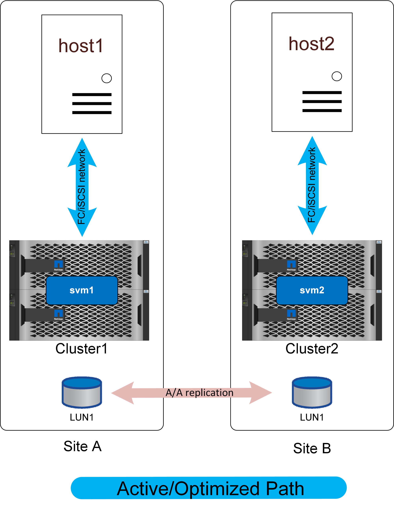

= Acesso não uniforme
:allow-uri-read: 
:imagesdir: ../media/

[role="lead"]
A rede de acesso não uniforme significa que cada host só tem acesso às portas no sistema de storage local. A SAN não é estendida entre sites (ou domínios de falha dentro do mesmo site).

O principal benefício dessa abordagem é a simplicidade da SAN - você elimina a necessidade de estender uma SAN pela rede. Alguns clientes não têm conetividade de baixa latência suficiente entre locais ou não têm infraestrutura para túnel do tráfego SAN FC em uma rede entre locais.

A desvantagem para o acesso não uniforme é que certos cenários de falha, incluindo a perda do link de replicação, resultarão em alguns hosts perdendo acesso ao armazenamento. Os aplicativos que são executados como instâncias únicas, como um banco de dados não agrupado, que inerentemente está sendo executado apenas em um único host em qualquer montagem, falharão se a conetividade de armazenamento local for perdida. Os dados ainda seriam protegidos, mas o servidor de banco de dados não teria mais acesso. Ele precisaria ser reiniciado em um local remoto, de preferência através de um processo automatizado. Por exemplo, o VMware HA pode detetar uma situação de todos os caminhos em um servidor e reiniciar uma VM em outro servidor onde os caminhos estão disponíveis.

Em contraste, um aplicativo em cluster, como o Oracle RAC, pode fornecer um serviço que está disponível simultaneamente em dois locais diferentes. Perder um site não significa perda do serviço do aplicativo como um todo. As instâncias ainda estão disponíveis e em execução no local sobrevivente.

Em muitos casos, a sobrecarga de latência adicional de um aplicativo que acessa o storage em um link local a local seria inaceitável. Isso significa que a disponibilidade aprimorada de redes uniformes é mínima, uma vez que a perda de armazenamento em um local levaria à necessidade de encerrar serviços nesse local com falha de qualquer maneira.

NOTE: Há caminhos redundantes pelo cluster local que não são mostrados nesses diagramas por uma questão de simplicidade. Os sistemas de storage da ONTAP estão HA, portanto, uma falha da controladora não deve resultar em falha do local. Deve apenas resultar em uma mudança na qual os caminhos locais são usados no site afetado.
