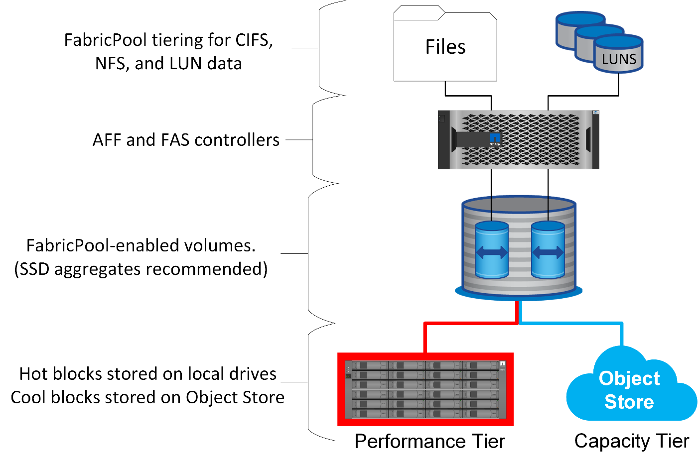

= Visão geral
:hardbreaks:
:allow-uri-read: 
:nofooter: 
:icons: font
:linkattrs: 
:imagesdir: ../media/

[role="lead"]
Entender como a disposição em camadas do FabricPool afeta a Oracle e outros bancos de dados requer um entendimento da arquitetura FabricPool de baixo nível.

== Arquitetura

O FabricPool é uma tecnologia em camadas que classifica os blocos como ativos ou inativos e os coloca na camada mais apropriada de storage. A camada de performance fica na maioria das vezes localizada no storage SSD e hospeda os blocos de dados ativos. A camada de capacidade fica em um armazenamento de objetos e hospeda os blocos de dados inativos. O suporte ao storage de objetos inclui NetApp StorageGRID, ONTAP S3, storage Microsoft Azure Blob, serviço de storage de objetos Alibaba Cloud, IBM Cloud Object Storage, storage do Google Cloud e Amazon AWS S3.

Várias políticas de disposição em camadas estão disponíveis para controlar a classificação dos blocos como ativo ou inativo. Além disso, as políticas podem ser definidas por volume e alteradas conforme necessário. Somente os blocos de dados são movidos entre as categorias de performance e capacidade. Os metadados que definem a estrutura do sistema de arquivos e LUN sempre permanecem no nível de performance. Como resultado, o gerenciamento é centralizado no ONTAP. Os arquivos e LUNs não são diferentes dos dados armazenados em qualquer outra configuração do ONTAP. O controlador NetApp AFF ou FAS aplica as políticas definidas para mover dados para o nível apropriado.

== Provedores de armazenamento de objetos

Os protocolos de armazenamento de objetos usam solicitações HTTP ou HTTPS simples para armazenar um grande número de objetos de dados. O acesso ao armazenamento de objetos deve ser confiável, pois o acesso aos dados do ONTAP depende do atendimento imediato das solicitações. As opções incluem as opções de acesso padrão e pouco frequentes do Amazon S3, além do Microsoft Azure Hot and Cool Blob Storage, IBM Cloud e Google Cloud. As opções de arquivamento, como o Amazon Glacier e o Amazon Archive, não são suportadas porque o tempo necessário para recuperar dados pode exceder as tolerâncias dos sistemas operacionais e aplicativos host.

O NetApp StorageGRID também é compatível e é uma solução de classe empresarial ideal. Ele é um sistema de storage de objetos de alto desempenho, dimensionável e altamente seguro que pode fornecer redundância geográfica para dados do FabricPool, bem como outras aplicações de armazenamento de objetos que provavelmente farão parte dos ambientes de aplicativos empresariais.

O StorageGRID também pode reduzir custos evitando as cobranças de saída impostas por muitos fornecedores de nuvem pública pela leitura de dados de seus serviços.

== Dados e metadados

Observe que o termo "dados" aqui se aplica aos blocos de dados reais, não aos metadados. Apenas os blocos de dados são dispostos em camadas, enquanto os metadados permanecem na camada de performance. Além disso, o status de um bloco como quente ou frio só é afetado pela leitura do bloco de dados real. A simples leitura do nome, carimbo de data/hora ou metadados de propriedade de um arquivo não afeta a localização dos blocos de dados subjacentes.

== Backups

Embora o FabricPool possa reduzir significativamente o espaço físico do storage, ele não é por si só uma solução de backup. Os metadados do NetApp WAFL sempre permanecem no nível de performance. Se um desastre catastrófico destruir o nível de performance, não será possível criar um novo ambiente usando os dados na categoria de capacidade porque não contém metadados do WAFL.

No entanto, o FabricPool pode se tornar parte de uma estratégia de backup. Por exemplo, o FabricPool pode ser configurado com a tecnologia de replicação NetApp SnapMirror. Cada metade do espelho pode ter sua própria conexão com um destino de armazenamento de objetos. O resultado são duas cópias independentes dos dados. A cópia primária consiste em blocos na camada de performance e blocos associados na camada de capacidade, e a réplica é um segundo conjunto de blocos de performance e capacidade.
