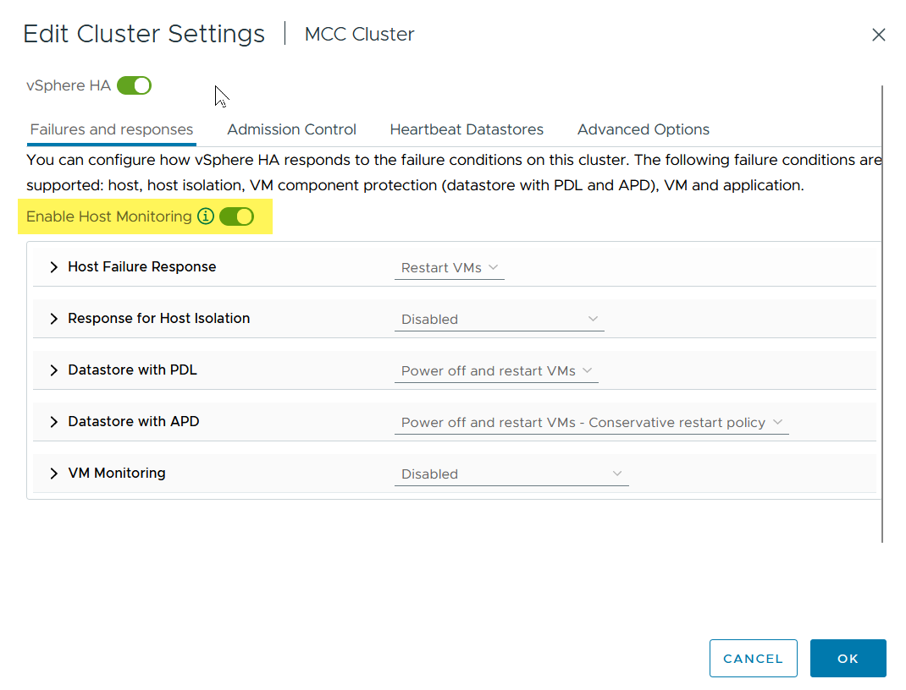

= Diretrizes de projeto e implementação do vMSC
:hardbreaks:
:allow-uri-read: 
:nofooter: 
:icons: font
:linkattrs: 
:imagesdir: ../media/

[role="lead"]
Este documento descreve as diretrizes de design e implementação do vMSC com sistemas de storage ONTAP.

== Configuração de armazenamento NetApp

As instruções de configuração para NetApp MetroCluster (referidas como uma configuração MCC) estão disponíveis em https://docs.netapp.com/us-en/ontap-metrocluster/["Documentação do MetroCluster"]. As instruções para a sincronização ativa do SnapMirror também estão disponíveis em https://docs.netapp.com/us-en/ontap/smbc/index.html["Visão geral da continuidade dos negócios da SnapMirror"].

Depois de configurar o MetroCluster, administrá-lo é como gerenciar um ambiente ONTAP tradicional. É possível configurar máquinas virtuais de storage (SVMs) usando várias ferramentas, como a interface de linha de comando (CLI), o System Manager ou o Ansible. Uma vez configurados os SVMs, crie interfaces lógicas (LIFs), volumes e números de unidades lógicas (LUNs) no cluster que será usado para operações normais. Esses objetos serão replicados automaticamente para o outro cluster usando a rede de peering de cluster.

Se não estiver usando o MetroCluster, você poderá usar o SnapMirror active Sync, que fornece proteção granular do armazenamento de dados e acesso ativo-ativo em vários clusters ONTAP em diferentes domínios de falha. O SnapMirror ative Sync usa grupos de consistência para garantir a consistência da ordem de gravação entre um ou mais datastores e você pode criar vários grupos de consistência, dependendo dos requisitos do aplicativo e do armazenamento de dados. Os grupos de consistência são especialmente úteis para aplicativos que exigem sincronização de dados entre vários datastores. A sincronização ativa do SnapMirror também suporta RDMs (Mapeamentos de dispositivo brutos) e armazenamento conetado ao convidado com iniciadores iSCSI in-Guest. Você pode aprender mais sobre grupos de consistência em https://docs.netapp.com/us-en/ontap/consistency-groups/index.html["Visão geral dos grupos de consistência"].

Há alguma diferença no gerenciamento de uma configuração vmsc com a sincronização ativa do SnapMirror quando comparada a um MetroCluster. Primeiro, essa é uma configuração somente SAN, nenhum datastores NFS pode ser protegido com a sincronização ativa do SnapMirror. Em segundo lugar, você deve mapear ambas as cópias dos LUNs para os hosts ESXi para que eles acessem os datastores replicados em ambos os domínios de falha.

== VMware vSphere HA

=== Crie um cluster do vSphere HA

A criação de um cluster do vSphere HA é um processo de várias etapas totalmente documentado em https://docs.vmware.com/en/VMware-vSphere/8.0/vsphere-vcenter-esxi-management/GUID-F7818000-26E3-4E2A-93D2-FCDCE7114508.html["Como criar e configurar clusters no vSphere Client em docs.vmware.com"]. Em suma, primeiro você deve criar um cluster vazio e, usando o vCenter, você deve adicionar hosts e especificar o vSphere HA e outras configurações do cluster.

NOTE: Nada neste documento substitui https://core.vmware.com/resource/vmware-vsphere-metro-storage-cluster-recommended-practices["Práticas recomendadas do VMware vSphere Metro Storage Cluster"]

Para configurar um cluster de HA, execute as seguintes etapas:

. Conete-se à IU do vCenter.
. Em hosts e clusters, navegue até o data center onde você deseja criar seu cluster de HA.
. Clique com o botão direito do rato no objeto do data center e selecione novo cluster. Em noções básicas, certifique-se de que você ativou o vSphere DRS e o vSphere HA. Conclua o assistente.

image::../media/vmsc_3_1.png[Novo cluster,624,302]

. Selecione o cluster e vá para a guia configurar. Selecione vSphere HA e clique em Edit.
. Em Monitoramento de host, selecione a opção Ativar monitoramento de host.

. Enquanto ainda estiver na guia falhas e respostas, em Monitoramento de VM, selecione a opção somente Monitoramento de VM ou a opção Monitoramento de VM e aplicativo.

image::../media/vmsc_3_3.png[Monitoramento de VM,624,480]

. Em Controle de admissão, defina a opção de controle de admissão HA para reserva de recursos de cluster; use 50% CPU/MEM.

image::../media/vmsc_3_4.png[Controle de admissão,624,479]

. Clique em "OK".
. Selecione DRS e clique EM editar.
. Defina o nível de automação para manual, a menos que seja necessário pelas suas aplicações.

image::../media/vmsc_3_5.png[vmsc 3 5,624,336]

. Ativar a proteção de componentes VM, https://docs.vmware.com/en/VMware-vSphere/8.0/vsphere-availability/GUID-F01F7EB8-FF9D-45E2-A093-5F56A788D027.html["docs.vmware.com"] consulte a .
. As seguintes configurações adicionais do vSphere HA são recomendadas para vMSC com MCC:

[cols="50%,50%"]
|===
| Falha | Resposta 

| Falha do host | Reinicie as VMs 

| Isolamento de host | Desativado 

| Armazenamento de dados com perda permanente de dispositivo (PDL) | Desligue e reinicie as VMs 

| Datastore com todos os caminhos para baixo (APD) | Desligue e reinicie as VMs 

| Hóspede não é coração batendo | Repor as VMs 

| Política de reinicialização da VM | Determinado pela importância da VM 

| Resposta para isolamento do host | Encerre e reinicie as VMs 

| Resposta para datastore com PDL | Desligue e reinicie as VMs 

| Resposta para datastore com APD | Desligar e reiniciar as VMs (conservadoras) 

| Atraso para failover de VM para APD | 3 minutos 

| Resposta para recuperação APD com tempo limite APD | Desativado 

| Sensibilidade de monitoramento da VM | Predefinição alta 
|===

=== Configurar datastores para Heartbearing

O vSphere HA usa datastores para monitorar hosts e máquinas virtuais quando a rede de gerenciamento falhou. Você pode configurar como o vCenter seleciona armazenamentos de dados Heartbeat. Para configurar armazenamentos de dados para batimentos cardíacos, execute as seguintes etapas:

. Na seção Heartbearing do datastore, selecione usar datastores na Lista especificada e elogiar automaticamente, se necessário.
. Selecione os datastores que você deseja que o vCenter use em ambos os sites e pressione OK.

image::../media/vmsc_3_6.png[Uma captura de tela de uma Descrição do computador gerada automaticamente,624,540]

=== Configurar opções avançadas

*Detecção de falha do host*

Os eventos de isolamento ocorrem quando os hosts dentro de um cluster de HA perdem a conetividade com a rede ou com outros hosts no cluster. Por padrão, o vSphere HA usará o gateway padrão para sua rede de gerenciamento como endereço de isolamento padrão. No entanto, você pode especificar endereços de isolamento adicionais para o host fazer ping para determinar se uma resposta de isolamento deve ser acionada. Adicione dois IPs de isolamento que podem fazer ping, um por local. Não utilize o IP do gateway. A configuração avançada do vSphere HA usada é das.isolationaddress. Você pode usar endereços IP do ONTAP ou Mediator para esse fim.

 https://core.vmware.com/resource/vmware-vsphere-metro-storage-cluster-recommended-practices#sec2-sub5["core.vmware.com"]Consulte para obter mais informações___.__

image::../media/vmsc_3_7.png[Uma captura de tela de uma Descrição do computador gerada automaticamente,624,545]

Adicionar uma configuração avançada chamada das.heartbeatDsPerHost pode aumentar o número de datastores de heartbeat. Use quatro datastores de heartbeat (HB DSS) - dois por local. Use a opção "Selecionar a partir da lista, mas elogio". Isso é necessário porque, se um local falhar, você ainda precisará de dois DSS HB. No entanto, eles não precisam ser protegidos com MCC ou sincronização ativa do SnapMirror.

 https://core.vmware.com/resource/vmware-vsphere-metro-storage-cluster-recommended-practices#sec2-sub5["core.vmware.com"]Consulte para obter mais informações___.__

Afinidade do VMware DRS para NetApp MetroCluster

Nesta seção, criamos grupos DRS para VMs e hosts para cada site/cluster no ambiente MetroCluster. Em seguida, configuramos regras VM/Host para alinhar a afinidade do host da VM com os recursos de armazenamento local. Por exemplo, as VMs do Site A pertencem ao grupo VM sitea_vms e os hosts do Site A pertencem ao grupo de hosts sitea_hosts. Em seguida, nas regras VM/Host, declaramos que o sitea_vms deve ser executado em hosts no sitea_hosts.

=== _Melhor prática_

* O NetApp recomenda altamente a especificação *deve ser executada em hosts no Grupo* em vez da especificação *deve ser executada em hosts no Grupo*. No caso de uma falha de host de um local, as VMs do local A precisam ser reiniciadas em hosts no local B por meio do vSphere HA, mas a última especificação não permite que o HA reinicie VMs no local B porque é uma regra geral. A especificação anterior é uma regra suave e será violada em caso de HA, permitindo assim disponibilidade em vez de desempenho.

*[NOTA]

* Você pode criar um alarme baseado em eventos que é acionado quando uma máquina virtual viola uma regra de afinidade VM-Host. No vSphere Client, adicione um novo alarme para a máquina virtual e selecione "VM está violando a regra de afinidade VM-Host" como o gatilho do evento. Para obter mais informações sobre como criar e editar alarmes, http://pubs.vmware.com/vsphere-51/topic/com.vmware.ICbase/PDF/vsphere-esxi-vcenter-server-51-monitoring-performance-guide.pdf["Monitoramento e desempenho do vSphere"] consulte a documentação.

=== Crie grupos de hosts DRS

Para criar grupos de hosts DRS específicos ao local A e local B, execute as seguintes etapas:

. No cliente da Web vSphere, clique com o botão direito do Mouse no cluster no inventário e selecione Configurações.
. Clique em VM/Host Groups.
. Clique em Adicionar.
. Digite o nome do grupo (por exemplo, sitea_hosts).
. No menu tipo, selecione Grupo anfitrião.
. Clique em Adicionar e selecione os hosts desejados no site A e clique em OK.
. Repita estas etapas para adicionar outro grupo de hosts para o local B.
. Clique em OK.

=== Crie grupos de VM DRS

Para criar grupos de VM DRS específicos para o local A e o local B, execute as seguintes etapas:

. No cliente da Web vSphere, clique com o botão direito do Mouse no cluster no inventário e selecione Configurações.

. Clique em VM/Host Groups.
. Clique em Adicionar.
. Digite o nome do grupo (por exemplo, sitea_vms).
. No menu tipo, selecione Grupo VM.
. Clique em Adicionar e selecione as VMs desejadas no local A e clique em OK.
. Repita estas etapas para adicionar outro grupo de hosts para o local B.
. Clique em OK.

=== Criar regras de host de VM

Para criar regras de afinidade do DRS específicas ao local A e ao local B, execute as seguintes etapas:

. No cliente da Web vSphere, clique com o botão direito do Mouse no cluster no inventário e selecione Configurações.

. Clique em VM/Host Rules.
. Clique em Adicionar.
. Digite o nome da regra (por exemplo, sitea_Affinity).
. Verifique se a opção Ativar regra está marcada.
. No menu tipo, selecione máquinas virtuais para hosts.
. Selecione o grupo VM (por exemplo, sitea_vms).
. Selecione o grupo Host (por exemplo, sitea_hosts).
. Repita estas etapas para adicionar outra VM/regra de host para o local B.
. Clique em OK.

image::../media/vmsc_3_8.png[Uma captura de tela de uma Descrição do computador gerada automaticamente,474,364]

== VMware vSphere Storage DRS for NetApp MetroCluster

=== Crie clusters de armazenamento de dados

Para configurar um cluster de datastore para cada site, execute as seguintes etapas:

. Usando o cliente da Web vSphere, navegue até o data center em que o cluster HA reside em Storage.
. Clique com o botão direito do rato no objeto do data center e selecione armazenamento > novo cluster do datastore.
. Selecione a opção Ativar o Storage DRS e clique em Avançar.
. Defina todas as opções como sem automação (modo manual) e clique em Avançar.

==== _Melhor prática_

* O NetApp recomenda que o DRS de armazenamento seja configurado no modo manual, para que o administrador possa decidir e controlar quando as migrações precisam acontecer.

image::../media/vmsc_3_9.png[Armazenamento DRS,528,94]

. Verifique se a caixa de verificação Ativar métricas de e/S para recomendações de SDRS está marcada; as configurações de métrica podem ser deixadas com os valores padrão.

. Selecione o cluster HA e clique em Next (seguinte).

image::../media/vmsc_3_11.png[Cluster DE HA,624,149]

. Selecione os datastores pertencentes ao site A e clique em Avançar.

. Reveja as opções e clique em concluir.
. Repita essas etapas para criar o cluster do datastore do site B e verifique se somente os datastores do site B estão selecionados.

=== Disponibilidade do vCenter Server

Os dispositivos do vCenter Server (VCSAs) devem ser protegidos com o vCenter HA. O vCenter HA permite implantar dois VCSAs em um par de HA ativo-passivo. Um em cada domínio de falha. Você pode ler mais sobre o vCenter HA no https://docs.vmware.com/en/VMware-vSphere/8.0/vsphere-availability/GUID-4A626993-A829-495C-9659-F64BA8B560BD.html["docs.vmware.com"].
