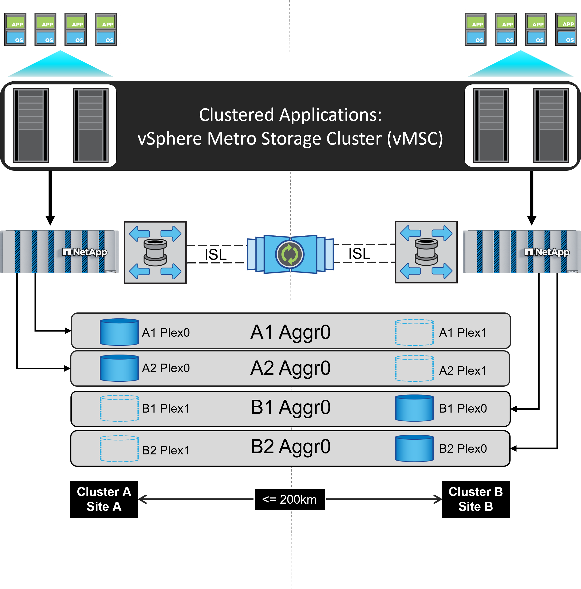

= Cluster de armazenamento do vSphere Metro com o ONTAP
:hardbreaks:
:allow-uri-read: 
:nofooter: 
:icons: font
:linkattrs: 
:imagesdir: ../media/

[role="lead"]
O hypervisor vSphere líder do setor da VMware pode ser implantado como um cluster estendido chamado vSphere Metro Storage Cluster (vMSC).

As soluções vmsc são suportadas com o NetApp MetroCluster e o SnapMirror ative Sync (anteriormente conhecido como SnapMirror Business Continuity, ou SMBC) e fornecem continuidade de negócios avançada se um ou mais domínios de falha sofrerem uma interrupção total. A resiliência a diferentes modos de falha depende de quais opções de configuração você escolher.

== Soluções de disponibilidade contínua para ambientes vSphere

A arquitetura do ONTAP é uma plataforma de storage flexível e dimensionável que fornece serviços SAN (FCP, iSCSI e NVMe-of) e nas (NFS v3 e v4,1) para datastores. Os sistemas de storage NetApp AFF, ASA e FAS usam o sistema operacional ONTAP para oferecer protocolos adicionais para acesso ao storage convidado, como S3 e SMB/CIFS.

A NetApp MetroCluster usa a função de HA (failover de controladora ou CFO) da NetApp para proteger contra falhas de controladora. Ele também inclui tecnologia SyncMirror local, failover de cluster em desastre (failover de controladora sob demanda ou CFOD), redundância de hardware e separação geográfica para alcançar altos níveis de disponibilidade. O SyncMirror espelha de forma síncrona os dados entre as duas metades da configuração do MetroCluster gravando dados em dois plexos: O Plex local (na gaveta local) fornecendo dados ativamente e o Plex remoto (na gaveta remota) normalmente não fornecendo dados. A redundância de hardware é implementada para todos os componentes MetroCluster, como controladores, armazenamento, cabos, switches (usados com Fabric MetroCluster) e adaptadores.

O NetApp SnapMirror active Sync fornece proteção granular do armazenamento de dados com os protocolos FCP e SAN iSCSI, permitindo que você proteja seletivamente apenas workloads de alta prioridade. Ele oferece acesso ativo-ativo a locais locais e remotos, ao contrário do NetApp MetroCluster, que é uma solução de espera ativa. A partir do ONTAP 9.15.1, o SnapMirror active Sync oferece suporte a uma funcionalidade ativo-ativo simétrica, permitindo operações de e/S de leitura e gravação de ambas as cópias de um LUN protegido com replicação síncrona bidirecional, permitindo que ambas as cópias do LUN atendam às operações de e/S localmente. Antes do ONTAP 9.15,1, a sincronização ativa do SnapMirror suporta apenas configurações ativas/ativas assimétricas, nas quais os dados no local secundário são aumentados para um LUN.

Para criar um cluster VMware HA/DRS em dois locais, os hosts ESXi são usados e gerenciados por um vCenter Server Appliance (VCSA). As redes de gerenciamento vSphere, vMotion e máquinas virtuais são conetadas por meio de uma rede redundante entre os dois sites. O vCenter Server que gerencia o cluster HA/DRS pode se conetar aos hosts ESXi em ambos os sites e deve ser configurado usando o vCenter HA.

 https://docs.vmware.com/en/VMware-vSphere/8.0/vsphere-vcenter-esxi-management/GUID-F7818000-26E3-4E2A-93D2-FCDCE7114508.html["Como criar e configurar clusters no vSphere Client"]Consulte para configurar o vCenter HA.

Você também deve se referir https://core.vmware.com/resource/vmware-vsphere-metro-storage-cluster-recommended-practices["Práticas recomendadas do VMware vSphere Metro Storage Cluster"] a .

== O que é o vSphere Metro Storage Cluster?

O vSphere Metro Storage Cluster (vMSC) é uma configuração certificada que protege máquinas virtuais (VMs) e contêineres contra falhas. Isso é conseguido usando conceitos de armazenamento estendidos juntamente com clusters de hosts ESXi, que são distribuídos em diferentes domínios de falha, como racks, edifícios, campi ou até mesmo cidades. As tecnologias de storage de sincronização ativa NetApp MetroCluster e SnapMirror são usadas para fornecer proteção RPO de 0 ou RPO de 0, respetivamente, para os clusters de host. A configuração do vMSC foi projetada para garantir que os dados estejam sempre disponíveis, mesmo que um "site" físico ou lógico completo falhe. Um dispositivo de armazenamento que faça parte da configuração do vMSC deve ser certificado após passar por um processo de certificação vMSC bem-sucedido. Todos os dispositivos de armazenamento suportados podem ser encontrados no https://www.vmware.com/resources/compatibility/search.php["Guia de compatibilidade do VMware Storage"].

Se você quiser obter mais informações sobre as diretrizes de design do vSphere Metro Storage Cluster, consulte a seguinte documentação:

* https://kb.vmware.com/s/article/2031038["Suporte ao VMware vSphere com o NetApp MetroCluster"]
* https://kb.vmware.com/s/article/83370["Suporte ao VMware vSphere com o NetApp SnapMirror Business Continuity"] (Agora conhecido como SnapMirror ative Sync)

Dependendo das considerações de latência, o NetApp MetroCluster pode ser implantado em duas configurações diferentes para uso com o vSphere:

* Stretch MetroCluster
* Fabric MetroCluster

A seguir ilustra um diagrama de topologia de alto nível do Stretch MetroCluster.

 https://www.netapp.com/support-and-training/documentation/metrocluster/["Documentação do MetroCluster"]Consulte para obter informações específicas sobre design e implantação do MetroCluster.

O SnapMirror ative Sync também pode ser implantado de duas maneiras diferentes.

* Assimétrico
* Sincronização ativa simétrica (ONTAP 9.15.1)

image::../media/vmsc_smas_mediator.png[Diagrama vMSC com MSAs e mediador]

 https://docs.netapp.com/us-en/ontap/smbc/index.html["Documentos do NetApp"]Consulte para obter informações específicas sobre design e implementação para sincronização ativa do SnapMirror.
