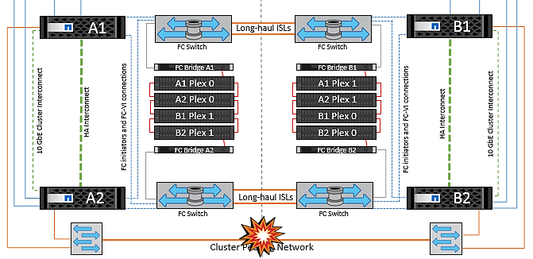

= Cenários de falha para vMSC com MCC
:hardbreaks:
:allow-uri-read: 
:nofooter: 
:icons: font
:linkattrs: 
:imagesdir: ../media/

[role="lead"]
As seções a seguir descrevem os resultados esperados de vários cenários de falha com sistemas vMSC e NetApp MetroCluster.

== Falha de caminho de storage único

Nesse cenário, se componentes como a porta HBA, a porta de rede, a porta do switch de dados front-end ou um cabo FC ou Ethernet falharem, esse caminho específico para o dispositivo de armazenamento será marcado como morto pelo host ESXi. Se vários caminhos forem configurados para o dispositivo de storage fornecendo resiliência na porta HBA/rede/switch, o ESXi executará idealmente um switchover de caminho. Durante esse período, as máquinas virtuais permanecem em execução sem serem afetadas, pois a disponibilidade para o armazenamento é tratada fornecendo vários caminhos para o dispositivo de armazenamento.

NOTE: Não há nenhuma mudança no comportamento do MetroCluster neste cenário, e todos os datastores continuam intactos de seus respetivos sites.

=== _Melhor prática_

Em ambientes em que os volumes NFS/iSCSI são usados, a NetApp recomenda ter pelo menos dois uplinks de rede configurados para a porta NFS vmkernel no vSwitch padrão e o mesmo no grupo de portas em que a interface NFS vmkernel é mapeada para o vSwitch distribuído. O agrupamento de NIC pode ser configurado em ativo-ativo ou ativo-standby.

Além disso, para iSCSI LUNs, multipathing deve ser configurado vinculando as interfaces vmkernel aos adaptadores de rede iSCSI. Para obter mais informações, consulte a documentação de armazenamento do vSphere.

=== _Melhor prática_

Em ambientes em que LUNs de Fibre Channel são usados, a NetApp recomenda ter pelo menos dois HBAs, o que garante resiliência no nível de HBA/porta. O NetApp também recomenda um iniciador único para o zoneamento de destino único como a melhor prática para configurar o zoneamento.

O VSC (Virtual Storage Console) deve ser usado para definir políticas de multipathing porque define políticas para todos os dispositivos de armazenamento NetApp novos e existentes.

== Falha única do host ESXi

image::../media/vmsc_5_1.png[Uma única falha de host.,624,598]

Nesse cenário, se houver uma falha do host ESXi, o nó mestre no cluster do VMware HA deteta a falha do host, já que ele não recebe mais batimentos cardíacos da rede. Para determinar se o host está realmente inativo ou apenas uma partição de rede, o nó mestre monitora os batimentos cardíacos do datastore e, se eles estiverem ausentes, ele executa uma verificação final fazendo ping nos endereços IP de gerenciamento do host com falha. Se todas essas verificações forem negativas, o nó principal declara que este host é um host com falha e todas as máquinas virtuais que estavam sendo executadas nesse host com falha são reinicializadas no host sobrevivente no cluster.

Se as regras de afinidade de host e VM DRS tiverem sido configuradas (as VMs no grupo VM sitea_vms devem executar hosts no grupo host sitea_hosts), o mestre HA primeiro verifica se há recursos disponíveis no local A. se não houver hosts disponíveis no local A, o mestre tentará reiniciar as VMs nos hosts no local B.

É possível que as máquinas virtuais sejam iniciadas nos hosts ESXi no outro site se houver uma restrição de recursos no site local. No entanto, as regras de afinidade de host e VM DRS definidas corrigirão se alguma regra for violada migrando as máquinas virtuais de volta para qualquer host ESXi sobrevivente no site local. Nos casos em que o DRS é definido como manual, o NetApp recomenda chamar o DRS e aplicar as recomendações para corrigir o posicionamento da máquina virtual.

Não há nenhuma mudança no comportamento do MetroCluster neste cenário e todos os datastores continuam intactos de seus respetivos sites.

== Isolamento do host ESXi

image::../media/vmsc_5_2.png[Isolamento do host ESXi,624,301]

Nesse cenário, se a rede de gerenciamento do host ESXi estiver inativa, o nó mestre no cluster HA não receberá nenhum heartbeats e, portanto, esse host fica isolado na rede. Para determinar se ele falhou ou está isolado apenas, o nó principal começa a monitorar o batimento cardíaco do datastore. Se estiver presente, o host é declarado isolado pelo nó mestre. Dependendo da resposta de isolamento configurada, o host pode optar por desligar, desligar as máquinas virtuais ou até mesmo deixar as máquinas virtuais ligadas. O intervalo padrão para a resposta de isolamento é de 30 segundos.

Não há nenhuma mudança no comportamento do MetroCluster neste cenário e todos os datastores continuam intactos de seus respetivos sites.

== Falha no compartimento de disco

Nesse cenário, há uma falha de mais de dois discos ou de uma gaveta inteira. Os dados são fornecidos do Plex sobrevivente sem interrupção para os serviços de dados. A falha do disco pode afetar um Plex local ou remoto. Os agregados serão apresentados como modo degradado porque apenas um Plex está ativo. Depois que os discos com falha forem substituídos, os agregados afetados serão ressincronizados automaticamente para reconstruir os dados. Após a ressincronização, os agregados retornarão automaticamente ao modo espelhado normal. Se mais de dois discos dentro de um único grupo RAID falharem, o Plex terá de ser reconstruído do zero.

image::../media/vmsc_5_3.png[Falha em um compartimento de disco único.,624,576]

*[NOTA]

* Durante esse período, não há impactos nas operações de e/S da máquina virtual, mas há desempenho degradado porque os dados estão sendo acessados do compartimento de disco remoto por meio de links ISL.

== Falha no controlador de storage único

Nesse cenário, um dos dois controladores de storage falha em um local. Como há um par de HA em cada local, uma falha de um nó aciona o failover automaticamente para o outro nó. Por exemplo, se o nó A1 falhar, o storage e os workloads serão transferidos automaticamente para o nó A2. As máquinas virtuais não serão afetadas porque todos os plexos permanecem disponíveis. Os segundo nós do local (B1 e B2) não são afetados. Além disso, o vSphere HA não tomará nenhuma ação porque o nó mestre no cluster ainda estará recebendo os batimentos cardíacos da rede.

image::../media/vmsc_5_4.png[Falha de nó único,624,603]

Se o failover fizer parte de um desastre contínuo (nó A1 faz failover para A2) e houver uma falha subsequente de A2 ou a falha completa do local A, o switchover após um desastre pode ocorrer no local B.

== Avarias na ligação InterSwitch

=== Falha de ligação InterSwitch na rede de gestão

image::../media/vmsc_5_5.png[Falha do link do InterSwitch na rede de gerenciamento,624,184]

Nesse cenário, se os links ISL na rede de gerenciamento de host front-end falharem, os hosts ESXi no local A não poderão se comunicar com hosts ESXi no local B. isso levará a uma partição de rede porque os hosts ESXi em um determinado local não poderão enviar os batimentos cardíacos da rede para o nó mestre no cluster HA. Como tal, haverá dois segmentos de rede por causa da partição e haverá um nó mestre em cada segmento que protegerá as VMs de falhas de host dentro do site específico.

NOTE: Durante esse período, as máquinas virtuais permanecem em execução e não há alteração no comportamento do MetroCluster nesse cenário. Todos os armazenamentos de dados continuam intactos de seus respetivos sites.

=== Falha na ligação InterSwitch na rede de armazenamento

image::../media/vmsc_5_6.png[Falha de ligação InterSwitch na rede de armazenamento,624,481]

Nesse cenário, se os links ISL na rede de armazenamento de back-end falharem, os hosts no local A perderão acesso aos volumes de armazenamento ou LUNs do cluster B no local B e vice-versa. As regras do VMware DRS são definidas para que a afinidade do local de armazenamento de host facilite a execução das máquinas virtuais sem impactos no local.

Durante esse período, as máquinas virtuais permanecem em execução em seus respetivos sites e não há alteração no comportamento do MetroCluster nesse cenário. Todos os armazenamentos de dados continuam intactos de seus respetivos sites.

Se, por algum motivo, a regra de afinidade foi violada (por exemplo, VM1, que deveria ser executado a partir do site A, onde seus discos residem em nós de cluster local A, está sendo executado em um host no local B), o disco da máquina virtual será acessado remotamente por meio de links ISL. Devido à falha do link ISL, o VM1 em execução no local B não seria capaz de gravar em seus discos porque os caminhos para o volume de armazenamento estão inativos e essa máquina virtual específica está inativa. Nessas situações, o VMware HA não toma nenhuma ação, uma vez que os hosts estão enviando batimentos cardíacos ativamente. Essas máquinas virtuais precisam ser manualmente desligadas e ligadas em seus respetivos sites. A figura a seguir ilustra uma VM que viola uma regra de afinidade DRS.

image::../media/vmsc_5_7.png[Uma VM que viola uma regra de afinidade DRS não consegue gravar em discos após falha do ISL,624,502]

=== Todas as falhas do InterSwitch ou completa partição do data center

Neste cenário, todos os links ISL entre os sites estão inativos e ambos os sites são isolados uns dos outros. Como discutido em cenários anteriores, como falha de ISL na rede de gerenciamento e na rede de armazenamento, as máquinas virtuais não são afetadas em falha completa de ISL.

Depois que os hosts ESXi forem particionados entre sites, o agente do vSphere HA verificará os batimentos cardíacos do datastore e, em cada site, os hosts ESXi locais poderão atualizar os batimentos cardíacos do datastore para o respetivo volume/LUN de leitura e gravação. Os hosts no local A assumirão que os outros hosts ESXi no local B falharam porque não há heartbeats de rede/datastore. O vSphere HA no local A tentará reiniciar as máquinas virtuais do local B, o que acabará falhará porque os datastores do local B não estarão acessíveis devido a falha do ISL de armazenamento. Uma situação semelhante é repetida no local B..

image::../media/vmsc_5_8.png[Todas as falhas ISL ou partição completa do data center,624,596]

A NetApp recomenda determinar se alguma máquina virtual violou as regras do DRS. Todas as máquinas virtuais executadas a partir de um site remoto ficarão inativas, uma vez que não poderão acessar o datastore, e o vSphere HA reiniciará essa máquina virtual no site local. Depois que os links ISL estiverem novamente online, a máquina virtual que estava sendo executada no local remoto será morta, uma vez que não pode haver duas instâncias de máquinas virtuais executando com os mesmos endereços MAC.

image::../media/vmsc_5_9.png[Uma partição de data center onde VM1 violou uma regra de afinidade DRS,624,614]

=== Falha de ligação InterSwitch em ambas as malhas no NetApp MetroCluster

Em um cenário de falha de um ou mais ISLs, o tráfego continua através dos links restantes. Se todos os ISLs em ambas as malhas falharem, de modo que não haja nenhum link entre os locais para armazenamento e replicação do NVRAM, cada controladora continuará fornecendo seus dados locais. Na restauração de um mínimo de um ISL, a ressincronização de todos os plexos acontecerá automaticamente.

Quaisquer gravações que ocorram depois de todos os ISLs estarem inativos não serão espelhadas para o outro site. Um switchover em caso de desastre, enquanto a configuração estiver nesse estado, incorreria, portanto, na perda dos dados que não haviam sido sincronizados. Neste caso, a intervenção manual é necessária para a recuperação após a mudança. Se for provável que nenhum ISLs esteja disponível por um período prolongado, um administrador pode optar por encerrar todos os serviços de dados para evitar o risco de perda de dados se for necessário um switchover em caso de desastre. A execução dessa ação deve ser ponderada contra a probabilidade de um desastre exigir mudança antes de pelo menos uma ISL ficar disponível. Alternativamente, se os ISLs estiverem falhando em um cenário em cascata, um administrador pode acionar um switchover planejado para um dos sites antes que todos os links tenham falhado.

image::../media/vmsc_5_10.png[Falha do link do InterSwitch em ambas as telas no NetApp MetroCluster.,624,597]

=== Falha na ligação do cluster de peered

Em um cenário de falha de enlace de cluster com peered, como os ISLs de malha ainda estão ativos, os serviços de dados (leituras e gravações) continuam em ambos os locais para ambos os plexos. Qualquer alteração na configuração de cluster (por exemplo, adicionar um novo SVM, provisionar um volume ou LUN em um SVM existente) não pode ser propagado para o outro local. Estes são mantidos nos volumes de metadados locais do CRS e propagados automaticamente para o outro cluster após a restauração do link do cluster de peered. Se for necessário um switchover forçado antes que o link do cluster com peering possa ser restaurado, as alterações pendentes na configuração do cluster serão reproduzidas automaticamente da cópia replicada remota dos volumes de metadados no local que sobreviveu como parte do processo de switchover.

=== Falha no local completo

Em um local completo Um cenário de falha, os hosts ESXi no local B não receberão o heartbeat da rede dos hosts ESXi no local A porque estão inoperantes. O mestre de HA no local B verificará se os batimentos cardíacos do armazenamento de dados não estão presentes, declarará que os hosts no local A estão com falha e tentará reiniciar o local Uma máquina virtual no local B. durante esse período, o administrador de storage executa um switchover para retomar os serviços dos nós com falha no local sobrevivente, o que restaurará todos os serviços de armazenamento do Local A no local B. após o local A volumes ou LUNs estarem disponíveis no local B, o agente de HA tentará reiniciar o local B.

Se a tentativa do agente mestre do vSphere HA de reiniciar uma VM (que envolve registrá-la e ligá-la) falhar, a reinicialização será novamente tentada após um atraso. O atraso entre reinicializações pode ser configurado até um máximo de 30 minutos. O vSphere HA tenta reiniciar para um número máximo de tentativas (seis tentativas por padrão).

NOTE: O mestre de HA não inicia as tentativas de reinicialização até que o gerente de colocação encontre um armazenamento adequado, portanto, no caso de uma falha completa no local, isso seria depois que o switchover foi executado.

Se o local A tiver sido substituído, uma falha subsequente de um dos nós do local B sobreviventes pode ser tratada de forma otimizada pelo failover para o nó sobrevivente. Neste caso, o trabalho de quatro nós agora está sendo executado por apenas um nó. A recuperação neste caso consistiria em realizar um giveback para o nó local. Em seguida, quando o local A é restaurado, uma operação de switchback é executada para restaurar a operação de estado estável da configuração.

image::../media/vmsc_5_12.png[Falha completa no local,624,593]
